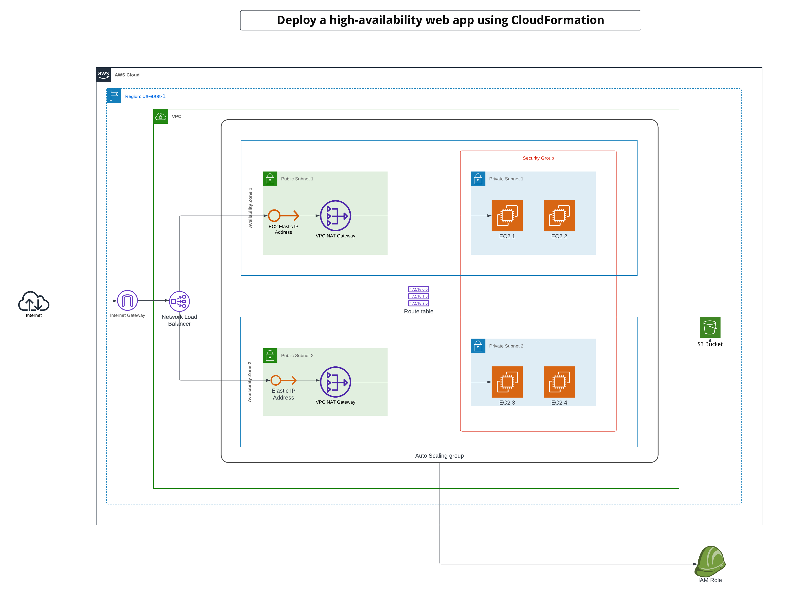

# Solution Diagram
The Udagram solution diagram is available at /diagram


# CloudFormation Networking Resources
Networking resouces: ./network/network.yml
Parameters : ./network/network-parameters.json

# CloudFormation Static Resources
Static resouces: ./static/static.yml
Parameters: ./stattic/static-parameters.json

# CloudFormation Apllication Resources
Application resouces: ./apllication/udagram.yml
parameters: ./apllication/udagram-parameters.json


# sh
there are 4 sh :
###
```sh sh/create.sh <stack-name> <stack-template.yml> <stack-template-params.json>```
###
```sh sh/update.sh <stack-name> <stack-template.yml> <stack-template-params.json>```
###
```sh sh/delete.sh <stack-name>```
###
1. create.sh : script for create the cloud formation infrastructure, please begin by cloudformation networking resources, then the cloud formation application resources following this order under (Receiving the StackId response significate the success of operations, you should then go to AWS CloudFormation console to see if ther's eventual Rollback and can see the Events for more logs).
###
```sh sh/create.sh udagram-network-stack network/network.yml network/network-parameters.json```
###
```sh sh/create.sh static-application-stack static/static.yml static/static-parameters.json```
###
```sh sh/create.sh udagram-application-stack application/udagram.yml application/udagram-parameters.json```
###
2. update.sh : if you change something in the two CloudFormation templates you can update the stack, using the sh under (Receiving the StackId response significate the success of operations, you should then go to AWS CloudFormation console to see if ther's eventual Rollback and can see the Events for more logs).
###
```sh sh/update.sh <stack-name> <stack-template.yml> <stack-template-params.json>```
###
```sh sh/update.sh udagram-network-stack network/network.yml network/network-parameters.json```
###
```sh sh/update.sh udagram-application-stack application/udagram.yml application/udagram-parameters.json```
###
###
```sh sh/update.sh udagram-static-stack application/static.yml application/static-parameters.json```
###
3. delete.sh : then you can remove the cloudformation infrastructure by executing the sh under.
###
```sh sh/delete.sh udagram-network-stack```
###
```sh sh/delete.sh udagram-application-stack```
###
4. deploy.sh : this script is dedicated to deploy the file index.html in the static resource (s3 bucket).
###
```sh sh/deploy.sh <local-file-path> <resource-name>```
###
```sh sh/deploy.sh server-content/index.html stagging-s3-bucket-1```
###
IMPORTANT : 
1. the stack-name should be unique
2. the order is important to follow, create first the network infrastructre then the static infrastructure and in last the application infrastructure.

# Output URL
the URL value is desplayed in the outputs of udagram stack, the key is WebsiteURL, for this stack this is the URL : http://udagr-webap-fkoy7kgn0am4-809098053.us-east-1.elb.amazonaws.com/